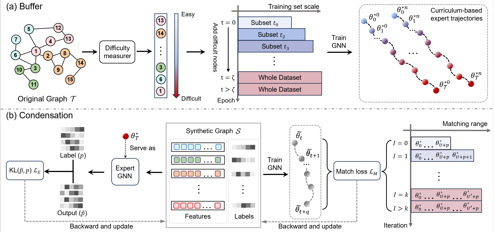

# GEOM
Pytorch implementation of "Navigating Complexity: Toward Lossless Graph Condensation via Expanding Window Matching".

The overall framework of the proposed GEOM:

## Requirements
Please see [requirements](/requirements)
